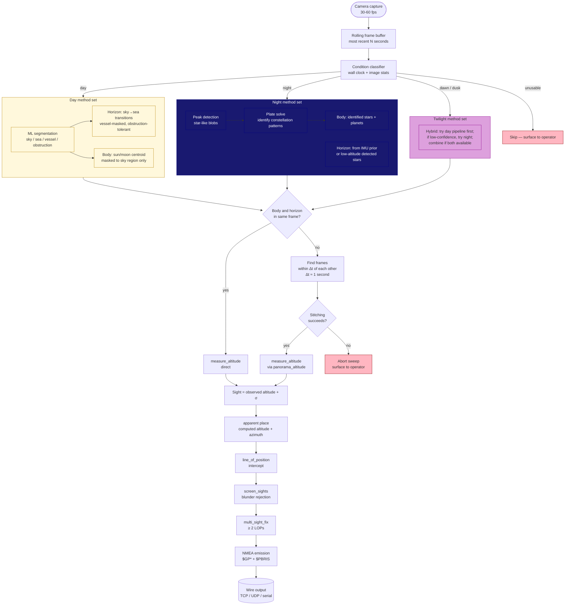

# Bris pipeline: from camera to fix

This document describes the end-to-end flow that turns a continuous
stream of camera frames into a celestial fix. It exists because the
pipeline has several conditional branches (day vs. night, single-frame
vs. stitched panorama, classical vs. ML detection) and the
relationships between them aren't obvious from any one source file.

The diagram below is Mermaid; it renders natively on GitHub and most
modern markdown viewers. A static SVG export lives alongside this
file at `docs/design/pipeline.svg` for environments that don't render
Mermaid.

## How the conditional branches fit together

### Continuous operation, not request/response

The architecture is **streaming, not request/response**. There is no
"take a sight" button at the core level (the mobile UI wraps the
streaming engine in a session-based UX, but that's a frontend
concern). Frames come in continuously; the pipeline classifies
conditions and chooses methods continuously; fixes come out whenever
enough sights of sufficient quality have accumulated.

### Condition classifier: wall clock + image statistics

The condition classifier decides which method set to use. Inputs:

- Wall clock UTC (gives rough sun position via almanac, hence
  expected day/night/twilight phase at the observer's location).
- Frame mean luma (confirms day vs. night vs. dim).
- Saturated-pixel count (high → day with bright sun in frame; low →
  twilight or night).
- Future: an ML day/night/twilight classifier (item 6 in the ML
  catalog in `plan.org`).

This is heuristic at the wall-clock level (we know the Sun's altitude
from the almanac before we look at any image) and confirmed by the
image. If they disagree (image is bright but the Sun should be 5°
below horizon, e.g. moonlit night with a flashlight in frame), the
classifier surfaces the disagreement rather than guessing.

### Day method set

Three components, all per-frame:

1. **ML semantic segmentation.** Runs the vendored model (currently
   SegFormer / ADE20K, eventually a Bris-specific model — see
   `plan.org`). Output: per-pixel class labels.
2. **Horizon detection.** Walks each column top-to-bottom in the
   segmentation mask. Sky→sea transitions are horizon candidates;
   sky→obstruction (distant land, distant vessel) candidates are
   accepted with elevated σ; sky→vessel candidates are skipped
   entirely. RANSAC line-fit through the candidates.
3. **Body detection.** Centroid the brightest connected region
   *within the sky mask only*. This eliminates false positives
   from sail glare, sun reflections on water, and deck saturation
   that would otherwise outvote the actual sun.

The classical (non-ML) horizon and centroid detectors remain
available for open-ocean scenes where they're faster and equally
accurate. Method selection is config-driven; default for cluttered
shipboard scenes is the ML-assisted path.

### Night method set

1. **Peak detection.** LoG-style detector finds star-like blobs.
2. **Plate solving.** Geometric pattern matching against the embedded
   star catalog. Output: identified star names and their measured
   pixel positions.
3. **Horizon at night is hard.** Three potential approaches:
   - **IMU prior.** When available (phone), gyro integration since
     the last sun-sight gives a horizon direction.
   - **Low-altitude detected stars.** Stars at ≤ 5° altitude can
     act as a horizon proxy if any are visible. Bowditch §17
     describes the technique; uncertainty is significant (refraction
     dominates at low altitude) but better than no horizon.
   - **Sea-sky luma boundary at night with bright moonlight.** Works
     in some conditions but unreliable.
   This is genuinely hard and tracked as a Phase 3 / 3.5 design
   problem. **Status: not yet implemented.**

### Twilight method set

The most challenging regime: sky is bright enough to wash out most
stars, but the Sun's altitude is too low for the day-sun pipeline to
work reliably (refraction near horizon dominates). The hybrid
strategy:

1. Try the day pipeline. If it produces a high-confidence horizon
   and a high-altitude bright body (sun, moon, or a daytime planet
   like Venus), use it.
2. Try the night pipeline on the same frames. If plate-solving
   succeeds, also use those sights.
3. Combine all available sights into the LSQ fix.

Twilight is also when **navigators historically take their best
sights** (the "morning star fix" and "evening star fix") because
multiple bright stars and a defined horizon are visible
simultaneously. So the pipeline has to handle this regime well, not
just survive it.

### Single-frame vs. stitched panorama

This is the question you asked specifically about, and the current
answer is:

**Horizon detection runs per-frame.** Body detection runs per-frame.
The panorama path (`bris_vision::panorama::panorama_altitude`)
selects the best horizon-detection result across all input frames
and the best body-centroid result across all input frames; if those
came from different frames, it computes the rigid-transform chain
between them so the body's pixel can be projected into the horizon
frame's coordinate system.

This means:
- A scene where every frame has both body and horizon in view (your
  sailing video) doesn't need stitching at all — the panorama path
  just picks the best frame.
- A scene where the camera sweeps from horizon to body (telephoto
  + high altitude, the design target case) needs the chain.
- A scene where neither holds — body and horizon never appear in
  the same frame *and* the chain can't be built — fails cleanly
  with `PanoramaError::TrackingFailed` or `NoHorizonFrame`.

The single-frame fast path: if any frame has both body and horizon
above the configured confidence threshold, just use it. Skip
stitching entirely. This is the common case and it's much cheaper
than the chain. The current `panorama_altitude` already does this
implicitly because `if horizon_idx == body_idx` short-circuits the
chain build.

### Frame window for stitching

User input: at 30-60 fps, the body moves across the sky at sidereal
rate (~15″/sec for an equatorial body). A 1-second window means at
most 15″ of body motion, which is below the per-sight σ floor in
good conditions. So **the stitching window is bounded by tolerance,
not by frame count**: include adjacent frames as long as the time
span is below a threshold derived from the user's accuracy target.

For a 0.5 nm fix target this is ~2 seconds; for a 5 nm fix target
it's ~30 seconds. Configurable. The current
`bris_vision::fusion::FusionConfig::max_window_seconds` defaults to
5 s and the streaming engine should compute it from the user's
accuracy target.

### Stage E ephemeris-driven stitch fallback

The primary cross-frame stitcher
(`bris_vision::panorama_altitude_for_pair`) uses Harris corners
+ NCC to recover the camera rotation between two frames. On
indoor / low-contrast / motion-blurred captures the corner
detector frequently fails to produce ≥ 8 reliable
correspondences and the stitcher returns
`PanoramaError::TrackingFailed`. The bedroom-moon corpus is the
motivating example.

When the operator is stationary and the camera is held roughly
still, the body's apparent motion between two frames is
well-predicted by the ephemeris alone (Earth rotates at ~15°/h
≈ 0.0042°/s, plus the body's own apparent motion). Stage E
falls back to an ephemeris-driven correspondence prior
(`bris_streaming::pipeline::ephemeris_stitch`) when Harris+NCC
declines and `EngineConfig::enable_ephemeris_stitch_fallback`
is `true` (default).

The fallback:

1. Projects the body's expected camera-frame ray at the body
   frame's timestamp and at the horizon frame's timestamp via
   `bris_almanac::body_apparent_place` at the engine's
   configured observer.
2. Converts the angular delta to a pixel delta in the body
   frame's intrinsics under a no-roll assumption, with an
   honest σ that combines almanac uncertainty, parallax
   sensitivity to the observer-position σ (re-evaluated at a
   perturbed observer latitude), and a roll-uncertainty
   contribution.
3. Looks up a body candidate in the horizon frame's body
   record (Day centroid, Night peak positions, or
   IdentifiedStars positions). Picks the one closest to the
   ephemeris-predicted point.
4. If the closest candidate's residual to the prediction is
   within 3·σ_px, accepts the correspondence under an
   identity-rotation (stationary-camera) assumption. Lifts
   the body centroid to a camera-space ray in body_frame's
   intrinsics, treats it as already in horizon_frame's
   coordinates, and composes with the horizon plane lifted
   from horizon_frame via `altitude_from_rays`.
5. Inflates the body-ray direction σ by
   `STITCH_SIGMA_PER_SECOND_RAD × Δt` (matches the cheap
   pair-selection stitch σ for honest accounting; the
   verification step bounds residual camera motion tighter
   than this, but using the existing constant keeps Stage E's
   per-sight σ consistent regardless of which stitcher
   accepted).

When no body candidate exists in the horizon frame, or the
closest candidate's residual is outside the 3·σ window, the
fallback declines and Stage E records the original Stitch
error. Three diagnostic counters surface the path's behavior:
`ephemeris_stitch_attempted`, `ephemeris_stitch_succeeded`,
`ephemeris_stitch_no_candidate_in_window` (the third covers
both "no candidate exists" and "closest candidate outside
window" — the candidate isn't *in the window* in either case).

The fallback is honest about its assumptions: it only accepts
when the verification candidate matches the ephemeris
prediction, which rules out cases where the camera moved
between frames or the brightest spot in the horizon frame is
not the same body.

### Single-LOP vs. multi-LOP fix

A single sight (one body, one moment) gives a line of position, not
a 2D fix. Multiple bodies in different azimuths give the LSQ fix.
At night with plate solving, a single frame can yield 5-10 stars at
different azimuths and produce a true fix immediately. In daytime
with one sun, you need at least two sun sights separated in time
(running fix) or one sun + one moon if the moon is visible. The
streaming engine accumulates sights into a rolling window; a fix
publishes when ≥ 2 azimuth-diverse sights are in the window.

The current `bris-cli replay` synthesizes a fake perpendicular LOP
to coax a 2D fix out of a single sight; that's a development hack
and the comment says so. The real engine waits for multiple
azimuth-diverse sights.

### Stage D dispatch policy

Stage D (plate solve) sits between Stage B (peak detection) and
Stage E (sight assembly). When Stage B emits a
`BodyDetection::Night(peaks)` payload, Stage D ordinarily passes
the peak set into `bris_platesolve::plate_solve` to identify
stars. That call costs ~30–50 ms per frame in release once the
geometric-hash database is built, regardless of how many peaks
the payload carries; on indoor / no-stars-visible scenes (the
bedroom-moon corpus is the canonical example) every Night-
classified frame burns that cost on a database lookup that's
structurally guaranteed to return nothing.

The `EngineConfig::stage_d_dispatch_policy` knob
(`StageDDispatchPolicy`) gates Stage D dispatch:

- **`Always`** — every Night payload is dispatched, matching the
  pre-gate behaviour. Preferred only for diagnostic replays
  where every solve attempt should be recorded even on payloads
  that cannot succeed.
- **`WhenStarsExpected`** *(default)* — dispatch only when the
  hysteresis-smoothed classifier verdict is `Night` AND Stage B
  produced ≥ 3 peaks. The 3-peak floor reflects that geometric-
  hash plate-solving needs at least three peaks to form a
  triangle pattern; below that the matcher cannot succeed.
  Twilight and Day frames are uniformly refused.
- **`Never`** — Stage D is uniformly skipped. Every Night payload
  remains as `BodyDetection::Night(peaks)` downstream. Useful
  for measuring the rest-of-pipeline cost in isolation.

Every gate refusal increments two engine diagnostics:
`EngineDiagnostics::stage_d_skipped_no_star_evidence` (the
gate-specific counter) and `stages[STAGE_D].skipped` (the
generic per-stage skip counter). Lazy plate-solver database
build (`PlateSolverInit::Lazy`) is also suppressed when the
first Night frame is refused by the gate — there is no point
spending the ~10–30 s build on a frame that wouldn't be solved
anyway. The next gate-admitted frame triggers the build.

The CLI exposes the knob as
`bris replay --stage-d-dispatch <always|when-stars-expected|never>`;
default unset inherits the engine config default.

### NMEA emission

Once the LSQ fix produces a position + covariance, the NMEA
formatters emit the standard sentences (`$GPGLL`, `$GPRMC`,
`$GPGGA`, `$GPGST`) plus the multi-subtype `$PBRIS` diagnostic
sentences. Every sentence is debug-logged via `tracing` so
deployments can observe exactly what's on the wire.

## Where the pipeline currently is in the codebase

| Pipeline stage | Module | Status |
|---|---|---|
| Camera capture | not yet implemented | will be V4L2 / AVFoundation / CameraX per platform |
| Rolling frame buffer | not yet implemented | future Phase 3.5 |
| Condition classifier | not yet implemented | Phase 3.5 |
| Day: ML segmentation | `bris-vision::segment` | working with vendored SegFormer / ADE20K |
| Day: horizon detection | `bris-vision::horizon::detect_horizon{,_via_sky_region,_via_segmentation}` | working |
| Day: body centroid | `bris-vision::centroid::centroid_brightest_body` | working but **not yet sky-masked** |
| Night: peak detection | `bris-vision::peak::detect_peaks` | working |
| Night: plate solving | `bris-platesolve` | **not yet implemented** |
| Night: horizon | not yet implemented | Phase 3 design problem |
| Twilight: hybrid | not yet implemented | Phase 3.5 |
| Single-frame measure | `bris-vision::measure::measure_altitude` | working |
| Stitching / panorama | `bris-vision::panorama::panorama_altitude` | working |
| Apparent place | `bris-almanac::apparent::body_apparent_place` | working |
| Sight reduction | `bris-nav::sight::line_of_position` | working |
| LSQ fix | `bris-nav::fix::multi_sight_fix` | working |
| Blunder screen | `bris-nav::screen::screen_sights` | working |
| NMEA emission | `bris-nmea::standard` and `bris-nmea::pbris` | working |
| Transport (TCP/UDP/serial) | not yet implemented | Phase 5 |

## Design principles (recap)

1. **Optical fixes are always published.** Nothing silently corrects.
2. **Honest uncertainty.** Every measurement carries σ; every fix
   carries a 2×2 covariance built from per-source contributions.
3. **Classical CV everywhere we can; ML only where classical
   genuinely fails.** Currently that's just horizon detection (and
   eventually the catalog of ML-assistance ideas in `plan.org`).
4. **No telemetry, no internet at runtime.** All ML inference is
   local.
5. **Continuous operation.** The user doesn't push "take sight" at
   the core level; the streaming engine publishes whenever a fix
   is available.
6. **Fail loudly, never silently.** Every failure mode in the
   pipeline returns a typed error rather than producing a wrong
   answer.
